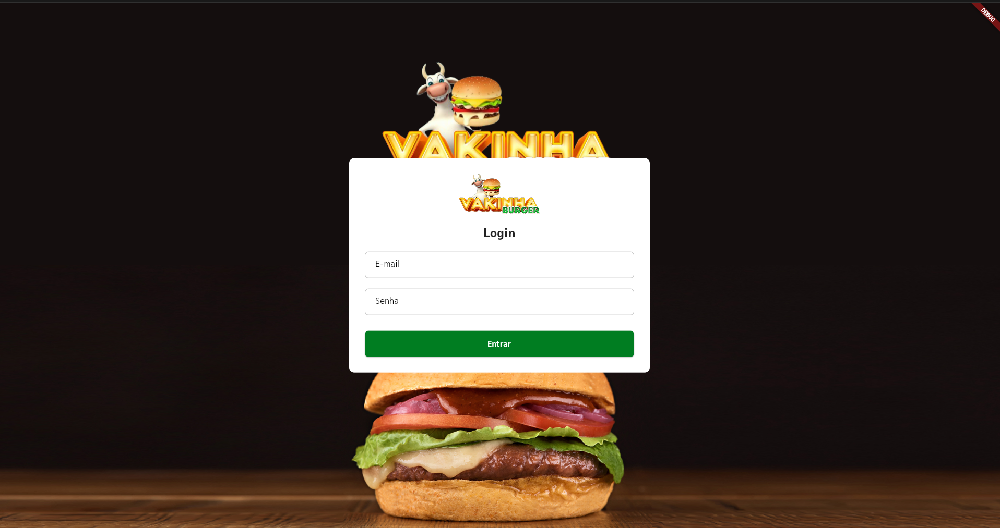
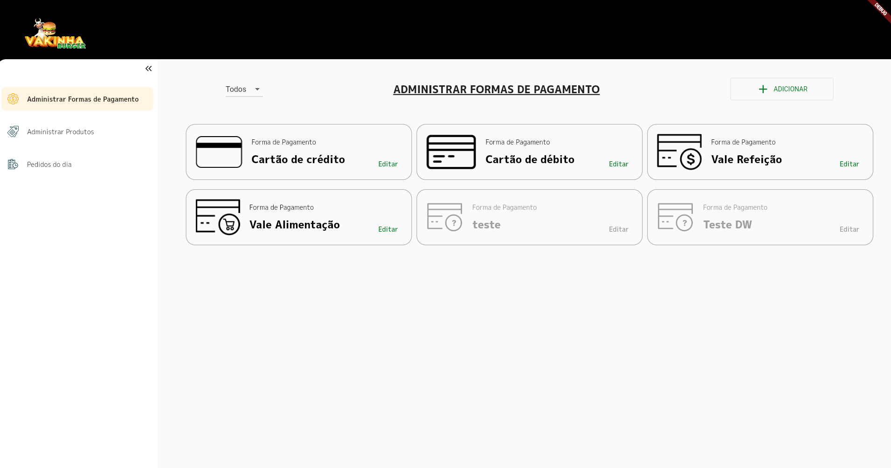
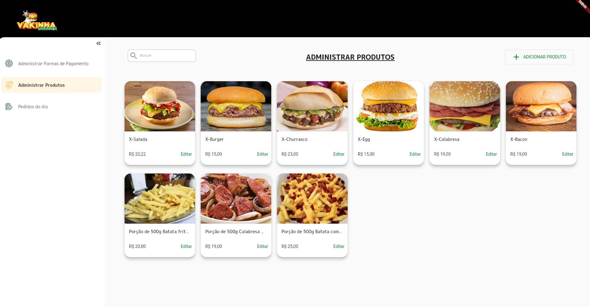
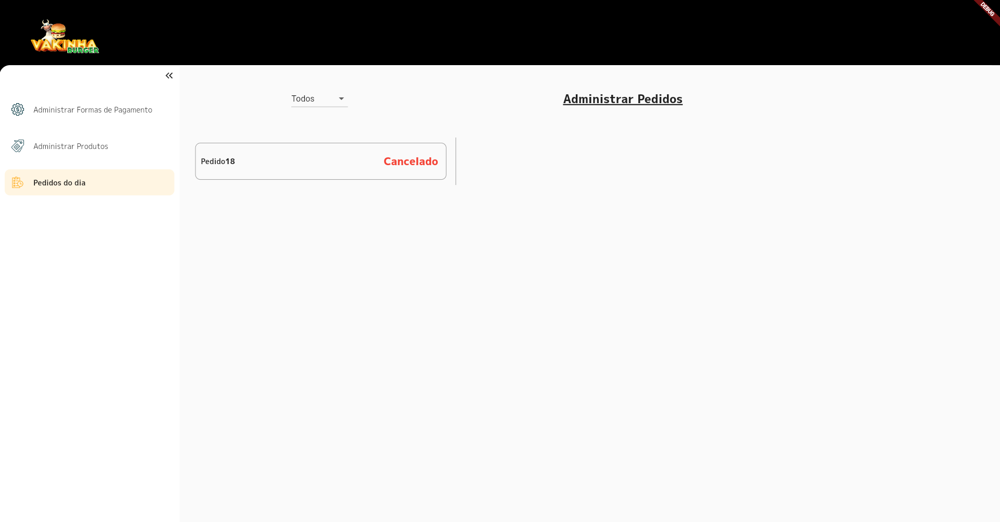

# Delivey Backoffice Dw10
# Vakinhaburger Admin

Projeto [Flutter](https://flutter.dev/) Web para administração de uma hamburgueria, feito na 10ª imerção Dart Week da Academia do Flutter.

A Aplicação foi feita utilizando [Flutter Modular](https://modular.flutterando.com.br/docs/flutter_modular/start) e [Mobx](https://mobx.netlify.app/).

## Packages utilizados

- [flutter_modular](https://pub.dev/packages/flutter_modular)
- [mobx](https://pub.dev/packages/mobx)
- [flutter_mobx](https://pub.dev/packages/flutter_mobx)
- [flutter_dotenv](https://pub.dev/packages/flutter_dotenv)
- [loading_animation_widget](https://pub.dev/packages/loading_animation_widget)
- [awesome_snackbar_content](https://pub.dev/packages/awesome_snackbar_content)
- [dio](https://pub.dev/packages/dio)
- [validatorless](https://pub.dev/packages/validatorless)
- [brasil_fields](https://pub.dev/packages/brasil_fields)
- [build_runner](https://pub.dev/packages/build_runner)
- [mobx_codegen](https://pub.dev/packages/mobx_codegen)

O projeto foi implementado utilizando-se uma backend local baseado em json, que necessita se ter instalado globalmente o package dart [json_rest_server](https://pub.dev/packages/json_rest_server). Tal backend foi apresentado durante a imerção.

## Como executar

1. Extraia em algum local de sua máquina o arquivo [dw10_delivery_api-master.zip](aux/dw10_delivery_api-master.zip) que está dentro da pasta /aux.
2. Dentro da pasta gerada apos a extração do arquivo no passo 1. Instale o package [json_rest_server](https://pub.dev/packages/json_rest_server) globalmente e execute:
```
json_rest_server run
```
1. Agora abra no terminal o projeto; e execute os comandos de obtenção de dependências do projeto, o comando de geração de código do mobx e por fim o comando para execução do projeto Flutter.
```
flutter pub get

dart run build_runner watch -d

flutter run
```

Dentro de /aux há um zip com todas as collections do postman do backend falado acima. Utilize-os!

## Imagens do projeto

### Tela de Login



### Módulo para adicionar formas de pagamento



### Administrar os produtos



### Gerenciamento dos Pedidos


